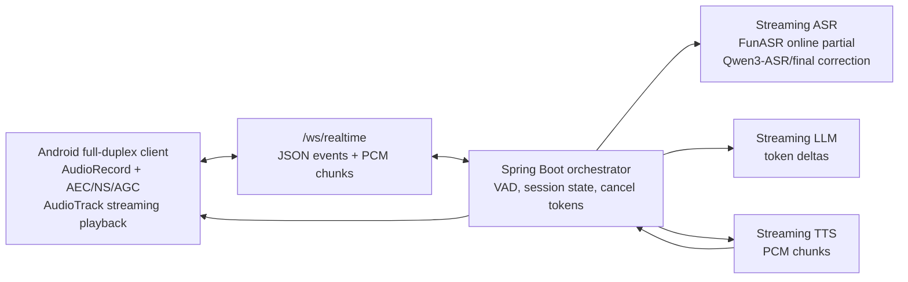

# Realtime Voice Architecture

The repo now uses an event-driven realtime path instead of the old "record, wait, recognize, answer, speak" path.

## Event Protocol

Client to server:

- `audio.chunk`: base64 PCM16LE mono audio frame, 16 kHz, normally 20 ms
- `interrupt`: user or client-side detector wants to stop assistant playback and generation
- `audio.end`: optional typed/text fallback for forcing a response

Server to client:

- `session.ready`
- `vad.speech_start`
- `vad.speech_end`
- `asr.partial`
- `asr.final`
- `llm.delta`
- `llm.done`
- `tts.start`
- `tts.chunk`
- `tts.done`
- `interrupt`
- `error`

## Barge-In

The client never stops recording during assistant playback. Android uses `VOICE_COMMUNICATION` plus platform `AcousticEchoCanceler`, `NoiseSuppressor`, and `AutomaticGainControl` so the server can keep listening while `AudioTrack` is playing.

When server VAD sees speech while `assistantSpeaking=true`, it:

1. Cancels the active TTS/LLM subscription.
2. Sends `interrupt`.
3. Starts collecting the new user utterance.
4. Emits fresh ASR partial/final events for the new turn.

## Next WebRTC Step

This MVP uses WebSocket PCM so it can run in a small repo without TURN/signaling setup. The next production step is to replace `FullDuplexAudioEngine` transport with LiveKit or WebRTC native:

- Keep the same `asr.partial`, `llm.delta`, `tts.chunk`, and `interrupt` data events.
- Move audio media from WebSocket PCM to RTP Opus.
- Keep Spring Boot as the AI orchestrator behind the realtime gateway.
- Let WebRTC provide jitter buffering and stronger device-specific AEC behavior.
